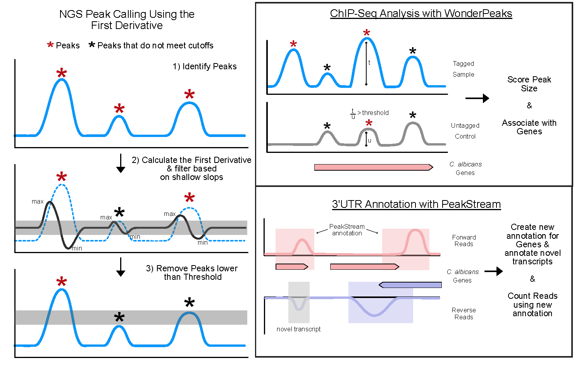

# WonderPeaks

<div style="text-align: center;">
    <h3>WonderPeaks</h3>
    
</div>

<div style="text-align: center;">
    <h3>PeakStream</h3>
    
</div>

WonderPeaks, a computational tool for analyzing RNA-seq (with poly-adenylation priming) and ChIP-seq data. WonderPeaks successfully identifies peaks (read pileups) in sequencing data, enabling the characterization of untranslated region boundaries in RNA-seq and detecting chromatin enrichment in ChIP-seq, providing valuable insights for fungal pathogen research.

### WonderPeaks workflow for ChIPseq and RNAseq


**Note:** This package is in beta, please report all bugs through the GitHub repository, and we will try to resolve any issues within a few weeks. We thank you for your patience.

# PROTOCOL: Instructions

## Installation (skip if completed)

### Prerequisites

#### Anaconda or Miniconda
Used to load requirements to run preprocessing and WonderPeaks workflows. A user guide for Anaconda can be found here: [Anaconda Getting Started](https://docs.anaconda.com/anaconda/getting-started/).

#### Python
Python can be installed within Anaconda or Miniconda.

#### Jupyter Notebooks
Jupyter Notebooks are used to execute all functions in this protocol. A beginner’s user guide for Jupyter Notebooks can be found here: [Jupyter Notebook Tutorial](https://www.dataquest.io/blog/jupyter-notebook-tutorial/).

**CAUTION:** For yeast genomes, ensure a compute environment with at least 20 cores, 8 GB of RAM, and 30GB of available disk space.

### Install Preprocessing Functions

#### Steps
1. In your terminal, execute:
    ```bash
    conda create -n WP_preprocessing
    ```
2. Activate the environment:
    ```bash
    conda activate WP_preprocessing
    ```
3. Update the environment:
    ```bash
    conda env update --file environment.yml --name <current_environment_name>
    ```
    **NOTE:** Download `environment.yml` from [WonderPeaks Preprocessing GitHub](https://github.com/mgarber21/WonderPeaks_preprocessing.git).
4. Install the preprocessing package:
    ```bash
    pip install WP_preprocessing
    ```
5. Deactivate the environment:
    ```bash
    conda deactivate WP_preprocessing
    ```

### Install WonderPeaks Functions

#### Steps
1. In your terminal, execute:
    ```bash
    conda create -n WonderPeaks
    ```
2. Activate the environment:
    ```bash
    conda activate WonderPeaks
    ```
3. Update the environment:
    ```bash
    conda env update --file environment.yml --name <current_environment_name>
    ```
    **NOTE:** Download `environment.yml` from [WonderPeaks GitHub](https://github.com/mgarber21/WonderPeaks.git).
4. Install WonderPeaks:
    ```bash
    pip install WonderPeaks
    ```
5. Deactivate the environment:
    ```bash
    conda deactivate WonderPeaks
    ```

### Notes

Steps above accomplish the following:
- Create a dedicated Conda environment for preprocessing and WonderPeaks workflows, isolating dependencies to avoid conflicts with other software.
- Activate the environment for installing and running WP_preprocessing or WonderPeaks-specific functions.
- Install the software dependencies and tools required for preprocessing your data.
- Deactivate the environment when not in use to prevent accidental modification and free up system resources.

### Download Jupyter Notebooks and Templates

1. Download the required Jupyter Notebooks and templates from the [WonderPeaks GitHub Repository](https://github.com/mgarber21/WonderPeaks.git).
2. Upload the WonderPeaks downloads to the operating system containing your raw data (directory will be created in the next step).

**NOTE:** The Jupyter Notebooks contain pre-written scripts and templates necessary for running preprocessing, WonderPeaks, and PeakStream workflows. Uploading them to the same system as your raw data ensures paths and directories align correctly.

## Create a Data Directory

WonderPeaks and PeakStream workflows require all data (raw and processed) to be stored in the same directory. Follow these steps to create the directory:

### Create a Data Directory

1. In your terminal, execute:
    ```bash
    mkdir {data_directory}
    # Example
    mkdir /path/to/your/data
    ```

### Create a Raw Data Subdirectory

1. In your terminal, execute:
    ```bash
    mkdir {data_directory}/raw_data
    # Example
    mkdir /path/to/your/data/raw_data
    ```

### Move Unprocessed Sequencing Reads

1. In your terminal, execute:
    ```bash
    mv {current_path_to_raw_data}/*fastq* {data_directory}/raw_data
    # Example
    mv current/data/path/*fastq* /path/to/your/data/raw_data
    ```

## Create User Inputs File (NGS_user_input.csv)

### Steps

1. Download the template `NGS_user_input.csv` from the WonderPeaks GitHub repository. See the `NGS_user_files` directory.
2. Update fields in the file:
    - `Data directory`: `/path/to/your/data`
    - `Genome directory`: `/path/to/your/genome`
    - `Genome fasta`: `genome.fasta`
    - `Genome annotation`: `genome_annotation.gtf`
3. Save the updated `user_input.csv` to the data directory created in the previous step.

**CAUTION:** Do not change the file name. WonderPeaks will only recognize this file if it is named `user_input.csv`.

## Create Metadata File (NGS_user_metadata.csv)

### Steps

1. Download the template `NGS_user_metadata.csv ` from the WonderPeaks GitHub repository. See the `NGS_user_files` directory.
2. Update fields in the file:
    - `file`: File name (no spaces; must include file extension but not absolute path).
    - `bedgraph`: Specify inclusion in PeakStream (`TRUE` or `FALSE`).
    - `designfactor1`: Specify a design factor relevant to the experimental design (e.g., treatment or sample_type).
    - `designfactor2`: Specify a second design factor relevant to the experimental design (e.g., strain or epitope).
3. Save the updated file to the data directory.


**CAUTION:**
- Design factor columns must not include unique replicate numbers.
- Use underscores (`_`) instead of spaces in design factor names.
- Ensure design factors match columns in `user_input.csv` exactly.

## Preprocessing NGS Data

For preprocessing, visit the [WonderPeaks Preprocessing GitHub Repository](https://github.com/mgarber21/WonderPeaks_preprocessing.git).

Skip to `WonderPeaks for ChIPseq` or `PeakStream for 3’RNAseq` if using custom preprocessing.

## WonderPeaks for ChIPseq

### Steps

1. Precheck:
    - Confirm all `.bedgraph` files are in the `bedgraphout` subdirectory of your data directory.
    - Confirm `designfactors` in `NGS_user_input.csv` match `NGS_user_metadata.csv`.
2. Open the `WP4ChIP.ipynb` Jupyter Notebook.
3. Activate WonderPeaks in the upper-right corner of the notebook interface.
4. Execute cells using `Shift+Enter` to run peak calling.
5. Define run parameters as prompted:
    - `score_cut`: Threshold for peak consideration.
    - `fold_change`: Threshold for tagged:untagged ratio.
    - `designfactor_value`: Experimental design factor value.
6. Execute remaining cells to run peak filtering and mapping.

**Output:** Results will be saved in a subdirectory named `WonderPeaks`.

## PeakStream for 3’RNAseq

### Steps

1. Precheck:
    - Confirm all `.bedgraph` files are in the `bedgraphout` subdirectory.
2. Open the `PeakStream.ipynb` Jupyter Notebook.
3. Activate WonderPeaks in the upper-right corner of the notebook interface.
4. Execute cells using `Shift+Enter` to run peak calling and mapping.

**Output:** Results will be saved in a subdirectory named `PeakStream`. 
**Output:** Results will be saved in a subdirectory named `featurecounts`. 
Your read counts generated with `featurecounts` (see https://rnnh.github.io/bioinfo-notebook/docs/featureCounts.html) using either the full length gene or the predicted3prime annotations will be saved in files with strarting with either `Gene` or `Predicted3prime`, respectively. By default, counts for genes of the protein-coding biotype will be saved in an additional file ending with `-protein-coding.txt`. 
e.g. `/path/to/your/data/featurecounts/predicted3primeUTR_STAR_counts-protein-coding.txt`
**Use this file to generate normalized counts and differential expression.**